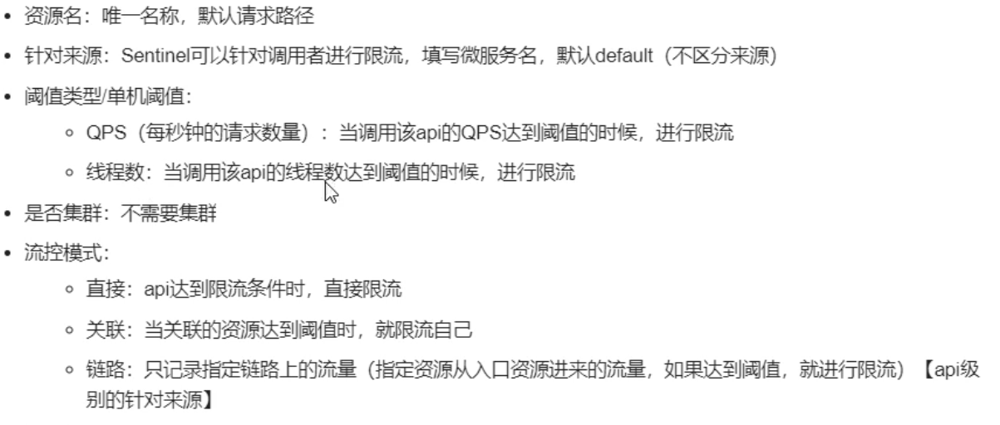

# Sentinel
> 无需手动搭建监控平台，没有web界面进行配置，实现服务降级与限流

## 部署
### docker
```sh
docker pull bladex/sentinel-dashboard
docker run --name sentinel -d  -p 8858:8858  bladex/sentinel-dashboard
```
> 访问地址 http://10.4.7.131:8858/

### window
> 下载地址 https://github.com/alibaba/Sentinel/releases

`
java -jar xxx.jar
`
> 访问地址 http://localhost:8080/


### 项目
> cloudalibaba-sentinel-service8401


## 流控规则


### 线程数
> 在程序内控制并发，只提供一个线程


## 降级
### RT(平均响应时间,秒级)
> 平均响应时间超过阈值且时间窗口内请求大于等于5触发断路器


### 异常比例(秒级)
> 异常比例超过阈值且时间窗口内请求大于等于5触发断路器


### 异常数(分钟级)
> 异常数超过阈值且时间窗口内请求大于等于5触发断路器


### 自定义兜底方法
> 注解@SentinelResource

## 热点key限流

```java
    @GetMapping("/testC")
    @SentinelResource(value = "testC",blockHandler = "deal_testC")
    public String testC(@RequestParam(value = "p1")String p1,@RequestParam(value = "p1")String p2){
        return "testC-----------";
    }

    public String deal_testC(String p1, String p2, BlockException blockException){
        return "deal_testC-----------";
    }
```
> 如果值为1 则阈值为200


## 系统规则

> 系统自适应限流从整体维度对应用的整体维度