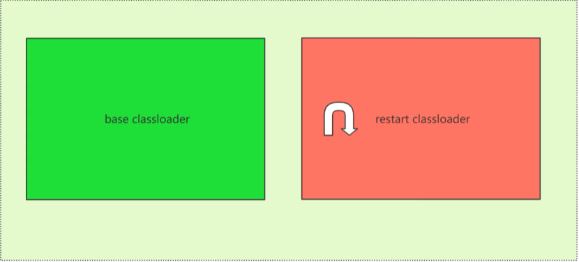

# 热部署
## 热部署的使用
> springBoot官方提供依赖
```java
    <dependency>
        <groupId>org.springframework.boot</groupId>
        <artifactId>spring-boot-devtools</artifactId>
        <optional>true</optional>
    </dependency>
```
idea:ctrl+F9会触发build 或者在setting>Compiler>自动编译  ctrl+alt+shift+/ 自动编译  
默认为切换窗口重启
## 热部署原理
### 原理图

### 排除文件
`
spring.devtools.restart.exclude=static/**,public/**
`
### 修改配置文件名称
`
spring.config.name
`
### 多环境多yml文件
```application.yml
spring:
  profiles:
    active: dev

单个文件
-Dspring.profiles.active = dev
spring:
 profiles: dev
```
