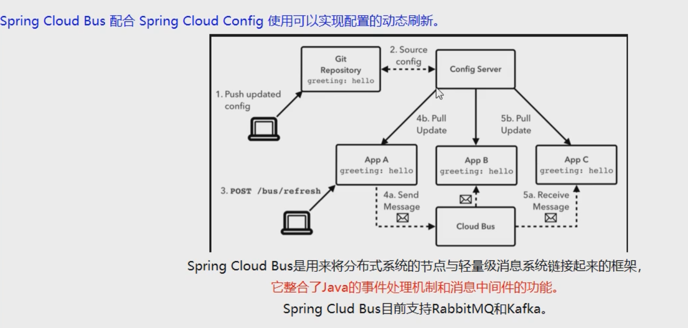
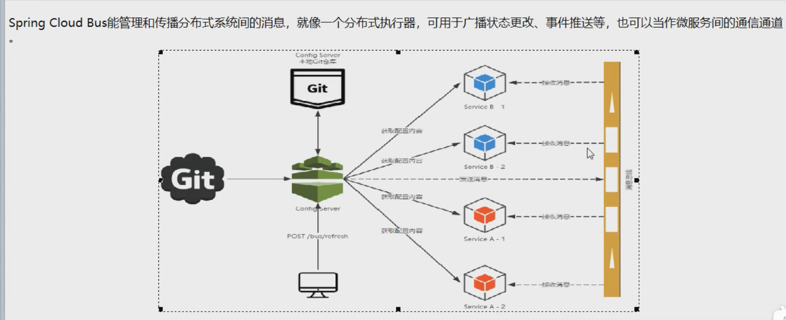

> [官网地址](https://cloud.spring.io/spring-cloud-static/spring-cloud-config/2.2.1.RELEASE/reference/html/)
* cloud-config-center3344
* cloud-config-client3366
* cloud-config-client3377
* cloud-eureka-server7001
* cloud-eureka-server7002

# Bus
> 为了实现动态配置更新,支持rabbitMQ和kafka



## 消息总线
> 让微服务中所有实例共用一个消息主题，称之为消息总线

### mq相关讲解
[mq](https://www.bilibili.com/video/av55976700)
```sh
docker pull rabbitmq：management
docker run -dit --name Myrabbitmq -e RABBITMQ_DEFAULT_USER=admin -e RABBITMQ_DEFAULT_PASS=admin -p 15672:15672 -p 5672:5672 rabbitmq:managemen
```
[mq地址](http://167.179.88.93:15672)

### 刷新方式
* 利用消息总线触发一个客户端/bus/refresh,从而刷新所有客户端配置
* 利用消息总线触发服务端/bus/refresh,从而刷新所有客户端配置
> 选择方式2  因为破坏了其中某个微服务的单一性,对等性,局限性

### 代码整合(广播与定点刷新)
#### 广播
```pom
        <!-- 消息总线 rabbitmq支持 -->
        <dependency>
            <groupId>org.springframework.cloud</groupId>
            <artifactId>spring-cloud-starter-bus-amqp</artifactId>
        </dependency>
        <!-- 监控 -->
        <dependency>
            <groupId>org.springframework.boot</groupId>
            <artifactId>spring-boot-starter-actuator</artifactId>
        </dependency>
# pom
  rabbitmq:
    host: 167.179.88.93
    port: 15673
    username: admin
    password: admin
# 暴露刷新
management:
  endpoints:
    web:
      exposure:
        include: bus-refresh

# 3台地址
http://localhost:3344/config-dev.yml
http://localhost:3366/info
http://localhost:3377/info

# 发送请求
curl  -X POST "http://localhost:3344/actuator/bus-refresh"
```
#### 定点
> curl  -X POST "http://localhost:3344/actuator/bus-refresh/{destination}"
> demo >>> curl -X POST "http://localhost:3344/actuator/bus-refresh/config-client:3366"