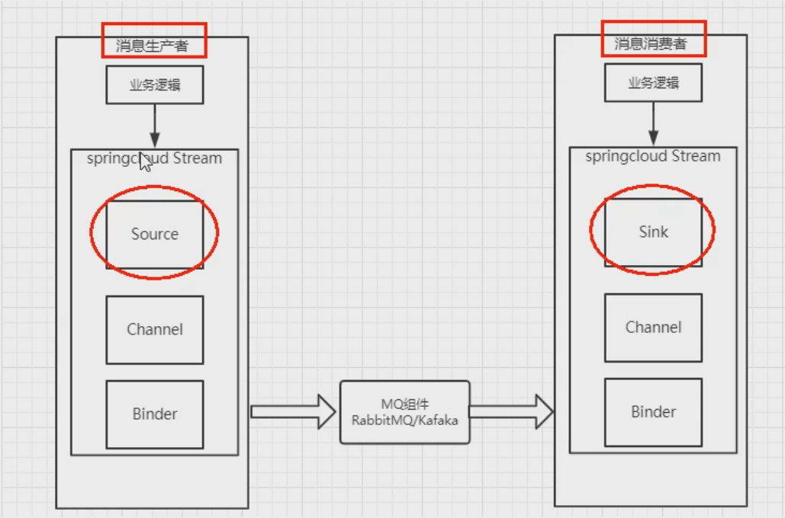

> [中文讲解](https://m.wang1314.com/doc/webapp/topic/20971999.html)
* cloud-eureka-server7001
* cloud-eureka-server7002
* cloud-stream-rabbitmq-provider8801
* cloud-stream-rabbitmq-consumer8802
* cloud-stream-rabbitmq-consumer8803

## 为什么引入cloud Stream
> 为了应对多个服务使用不同的消息中间件,导致切换、维护、开发相关问题,可以直接使用Stream操控不同的mq,同意消息的编程模型
> * 通过binder绑定
> * inputs输入
> * outputs输出

> 目前支持kafka和rabbitMQ

## 标准编码流程

### 注解
* Binder   　　　　　对于kafka来说是topic,rabbitMQ是exchange
* Input   　　　　　　输入通道
* Output  　　　　　　输出通道
* StreamListener 　　监听队列
* EnableBinding  　　将信道channel和exchange绑定在一起

### 基础生产 消费流程
```java
        // 核心依赖
        <dependency>
            <groupId>org.springframework.cloud</groupId>
            <artifactId>spring-cloud-starter-stream-rabbit</artifactId>
        </dependency>

spring:
  cloud:
    stream:
      binders:
        defaultRabbit:
          type: rabbit
          environment:
            spring:
              rabbitmq:
                host: 167.179.88.93
                port: 15673
                username: admin
                password: admin
      bindings:
        output: // 生产者output 消费者input
          destination: studyExchange
          content-type: application/json
          binder: defaultRabbit

@EnableBinding(Source.class) //生产者使用Source 消费者使用Sink
// 生产者发送消息代码
    @Resource
    private MessageChannel output; //消息发送管道

    @Override
    public String send() {
        String uuid = UUID.randomUUID().toString();
        output.send(MessageBuilder.withPayload(uuid).build());
        System.out.println("******uuid: " + uuid);
        return uuid;
    }
// 消费者接收消息代码
    @StreamListener(Sink.INPUT)
    public void input(Message<String> message){
        System.out.println("消费者8083->>>>>>>>>>>>" + message.getPayload() + "\t" + port);
    }
```
> 向 http://localhost:8801/sendMsg 发送信息，在8802项目控制台查看是否接收到信息

### 分组消费与持久化
#### 重复消费
> 在8802与8803都可以接收到8801的数据,为了避免重复消费，需要使用GROUP
```java
      bindings:
        input:
          destination: studyExchange
          content-type: application/json
          binder: defaultRabbit
          group: nanami //增加group名称
```
#### 持久化
> 在消费者宕机情况下 无法持久化 所以一定要配置group属性