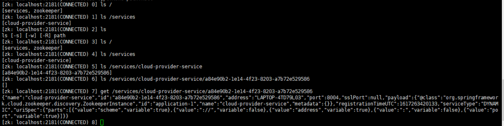

## 安装zookeeper(工程为cloud-consumerzk-order80 cloud-provider-payment8004)
>zookeeper为java开发 需要java环境
```sh
java -version

#没有java环境
tar -zxvf jdk-8u271-linux-i586.tar.gz -C /usr/local/jdk/

vim /etc/profile

export JAVA_HOME=/usr/local/jdk/jdk1.8.0_271
export JRE_HOME=${JAVA_HOME}/jre
export CLASSPATH=.:${JAVA_HOME}/lib:${JRE_HOME}/lib
export PATH=${JAVA_HOME}/bin:$PATH

source /etc/profile

ln -s /usr/local/jdk/jdk1.8.0_271/bin/java /usr/bin/java

java -version

#如果查询版本提示错误
yum install glibc.i686


#下载二进制压缩包
wget https://mirrors.tuna.tsinghua.edu.cn/apache/zookeeper/zookeeper-3.5.9/apache-zookeeper-3.5.9-bin.tar.gz

## 如果没有wget命令
yum install wget

#解压缩
tar -zxvf apache-zookeeper-3.5.9-bin.tar.gz

#移动至local下
mv apache-zookeeper-3.5.9-bin /usr/local

# 为了操作方便，创建软连接
ln -s /usr/local/apache-zookeeper-3.5.9-bin /usr/local/zookeeper

# 添加至环境变量
echo export PATH=\"\$PATH:/usr/local/zookeeper/bin\" >> ~/.bashrc

#更新环境变量
source ~/.bashrc

# 开放2181端口
firewall-cmd --zone=public --add-port=2181/tcp --permanent

#关闭2181端口
firewall-cmd --zone=public --remove-port=2181/tcp --permanent

# 配置立即生效
firewall-cmd --reload

# 复制一份配置文件
cp zoo_sample.cfg zoo.cfg
```

### 主要配置项

```sh
# 数据存放位置
dataDir=/usr/local/zookeeper/data
# 创建存放目录
cd /usr/local/zookeeper
mkdir data
```

### 启动
```sh
# 启动
cd /usr/local/zookeeper/bin
./zkServer.sh start
ps -ef | grep zoo
```

>zookeeper地址 http://10.4.7.131:2181/

### 新建项目8004
>pom文件将eureka换为zookeeper
```sh
        <dependency>
            <groupId>org.springframework.cloud</groupId>
            <artifactId>spring-cloud-starter-zookeeper-discovery</artifactId>
        </dependency>
```
>yml文件
```yml
server:
  port: 8004

spring:
  application:
    name: cloud-provider-service
  cloud:
    zookeeper:
      connect-string: 10.4.7.131:2181
```
>主启动类
```java
@SpringBootApplication
@EnableDiscoveryClient
public class PaymentMain8004 {
    public static void main(String[] args) {
        SpringApplication.run(PaymentMain8004.class,args);
    }
}
```
>启动后会出现版本不一致的问题 修改pom中版本
```pom
        <dependency>
            <groupId>org.springframework.cloud</groupId>
            <artifactId>spring-cloud-starter-zookeeper-discovery</artifactId>
            <!-- 排除自带jar包 替换为服务器上对应的版本-->
            <exclusions>
                <exclusion>
                    <groupId>org.apache.zookeeper</groupId>
                    <artifactId>zookeeper</artifactId>
                </exclusion>
            </exclusions>
        </dependency>
        <dependency>
            <groupId>org.apache.zookeeper</groupId>
            <artifactId>zookeeper</artifactId>
            <version>3.6.2</version>
        </dependency>
```
>成功启动项目后 在zk中查看是否注册成功
```sh
./zkCli.sh
```

>zk跟eureka具有类似的保护机制 为临时节点

工程为cloud-consumerzk-order80 cloud-provider-payment8004