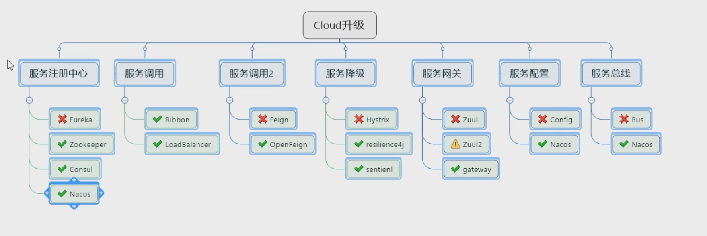

# 版本选择
> [版本查询](https://start.spring.io/actuator/info)

|工具|版本|
| :--: | :--: |
| springBoot | 2.2.2.RELEASE |
| springCloud | Hoxton.SR1 |
| cloud alibaba | 2.1.0.RELEASE |
| java | 8 |
| maven | 3.5 up |
| mysql | 5.7 up |

